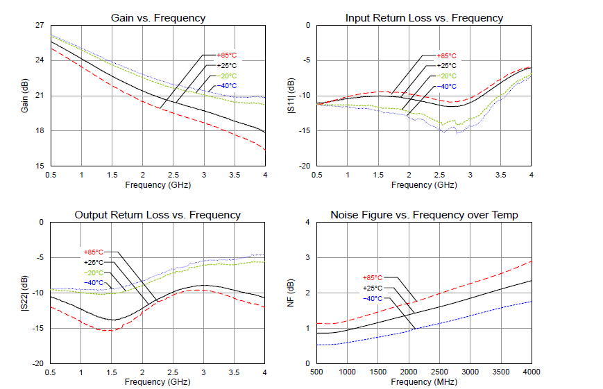

# LNA/Gain Blocks

Amplificadores são dispositicos eletrônicos utilizados em diversos equipamentos que tem por objetivo aumentar o valor da amplitude do sinal da entrada (podendo ser também ruído) e consequentemente aumentar também a potência.

Além de amplificar sinais ou ruídos, os amplificadores reais também possuem um ruído próprio que é adicionado ao sinal, sendo assim, vamos definir  SNRi como a relação sinal ruído na entrada do amplificador e SNRo na saída do amplificador, onde a diferença básica entre as duas grandezas é a relação da saída leva em conta o ruído adicionado pelo amplificador. Também podemos definir Figura de Ruído como SNRi/SNRo.

Estes parâmetros são importantes no cálculo da figura de ruído de diversos sitemas com amplificadores e outros componentes cascateados

Outros parâmetros importantes a se considerar na escolha de amplificadores são OP1dB e OIP3

### OP1dB

O ganho dos amplificadores cresce de maneira linear até o ponto de saturação, onde independente do aumento do sinal de entrada, o sinal de saída não cresce mais. Assim, se fizermos uma projeção da reta de ganho do amplificador e marcamos o ponto em que ela se distancia 1dB da região de saturação, podemos encontrar o OP1dB, como pode ser visto na imagem abaixo.

### OIP3

Os harmônicos dos sinais tamabém são amplificados, porém, a medida que a ordem dos harmônicos vão crescendo, eles vão tendo menos influência no sinal.

Sendo assim, faz-se uma análise do 3º harmônico. Se pegarmos a projeção reta de ganho do sinal e encontrarmos a interseção da projeção da reta de ganho do terceiro harmônico, encontraremos OIP3. Este ponto é uma extrapolação das duas retas e nunca vai ser alcançado por um dispositivo, porém, um sinal de entrada no amplificador deve ser estar longe do OIP3.

O OIP3 pode ser visto na figura abaixo

## Especificações

Sendo assim, alguns parâmetros importantes para a escolha de um amplificador são:

.Faixa de Operação
.Ganho
.Figura de Ruído
.OIP3
.OP1dB

É importante pontuar que na escolha de um amplicador, deve se escolher o componente mais ideal possível, ou seja, grande faixa de operação, grande ganho, pequena faixa de ruído e valores altos de OIP3 e OP1dB.

## Low Noise Amplifier - LNA

Este é um tipo especial de amplifi que adiciona apenas um pequeno ruído ao sistema.

## Gain Block

Este é um tipo de amplificador que está pronto para colocar na placa, já está todo polarizado e não precisa que circuito externo seja adicionado para que funcione.

## TQP3M9019 - High Linearity LNA Gain Block

Este amplificador possui as seguintes especificações:

Faixa de Operação: 20-4000MHz
Ganho: 22dB a 1900MHz
Figura de Ruído: 1.3dB
O1P3: 39.5dBm

Outros parâmetros importantes podem ser visto nos gráficos abaixo e no datasheet do componente.

